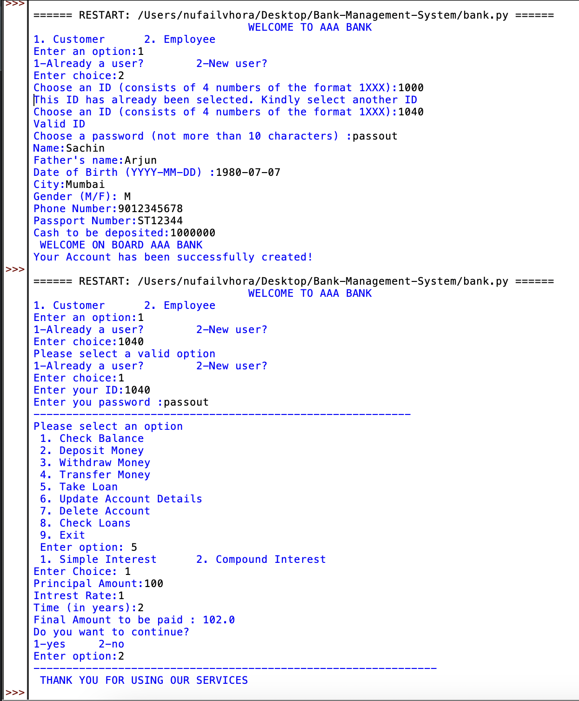
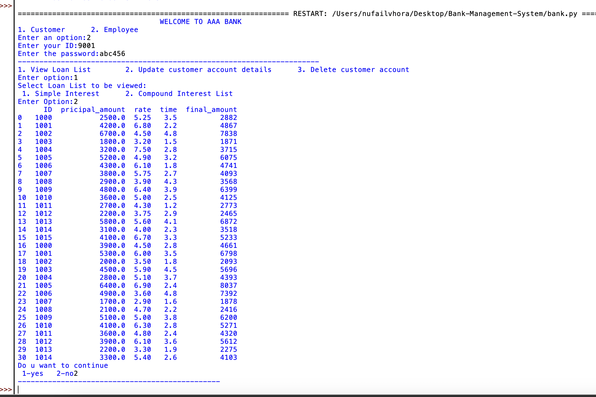

# Bank-Management-System


Welcome to the Bank Management System project! <br>
This project is built in Python and utilizes a MySQL database to manage banking operations. <br>
It is developed for the usage and assistance of bank customers. In this application, the customer can perform the folllowing operations:
- Check Balance
- Deposit Money
- Withdraw Money
- Transfer Money
- Take Loan
- Update Account
- View Account

An employee can also access the database using separate set of login credentials designed for the employee.

ER Diagram of the DataBase:


----
## INSTRUCTIONS TO USE

### Requirements
Before getting started, ensure that you have the following prerequisites installed on your system:
- MySQL server  [Link](https://dev.mysql.com/downloads/mysql/)
- Python (Python 3 recommended)  [Link](https://www.python.org/downloads/)
- pandas module
- mysql.connector module

You can install the required Python modules using the following command:
```bash
pip install pandas mysql-connector-python
```
In Case you have Python 3 installed on your sytem:
```bash
pip3 install pandas mysql-connector-python
```


### Setting Up the Database
To get started, you need to create a MySQL database and import the database structure and data. 
You can use the provided dump.sql file to set up the 'bank' database.

1. Open a terminal or command prompt and navigate to the directory where you have the dump.sql file.

2. Run the following command to import the dump.sql file into your MySQL database. Replace <DATABASE_USER> and <DATABASE_NAME> with your MySQL credentials and database name:

```bash
mysql -u <DATABASE_USER> -p <DATABASE_NAME> < dump.sql
```

### Running the Project
Clone this GitHub repository to your local machine.
Update the database connection details in the [bank.py](bank.py) file. Open [bank.py](bank.py) in a text editor and look for the following lines:

```python
host = os.environ.get('DB_HOST', 'localhost')  
usr = os.environ.get('DB_USER', 'root') 
pas = os.environ.get('DB_PASSWORD', '<DATABASE_PASSWORD>')   
db = os.environ.get('DB_DATABASE', '<DATABASE_NAME>')
```

Replace <DATABASE_PASSWORD>, and <DATABASE_NAME> with your MySQL credentials.
You can change 'root' to any other user want.

Run the [bank.py](bank.py)  file using Python:

```bash
python bank.py
```

The Bank Management System will now run, and you can interact with the banking operations through the terminal.


----
### Previews

## Customer-End Preview:

  
## Employee-End Preview:



